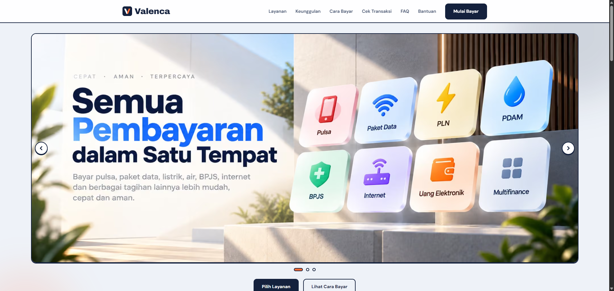
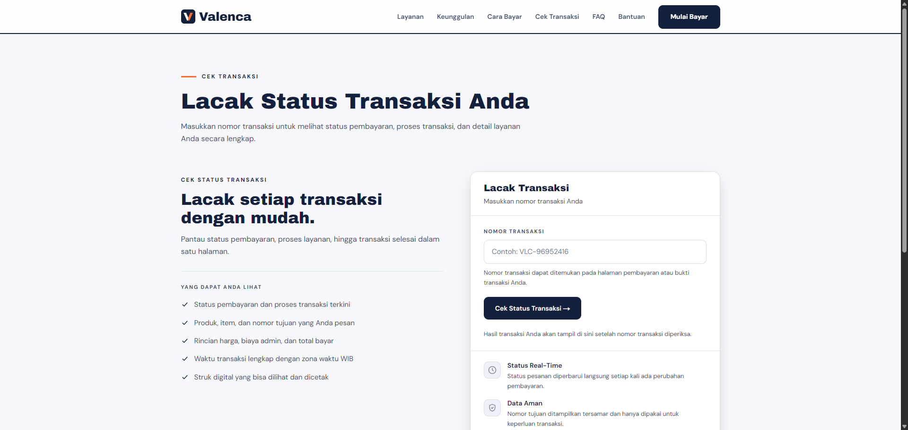
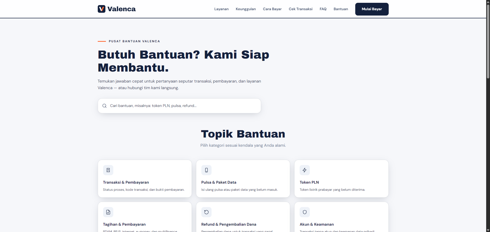
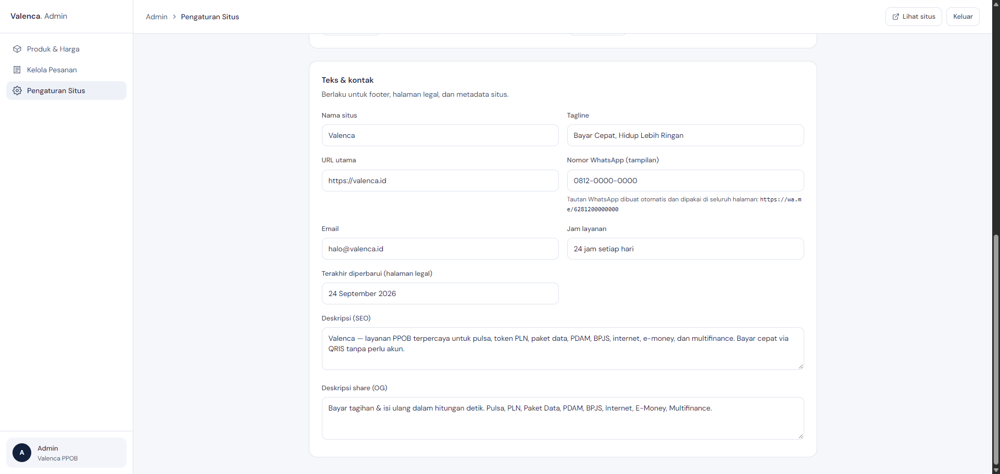
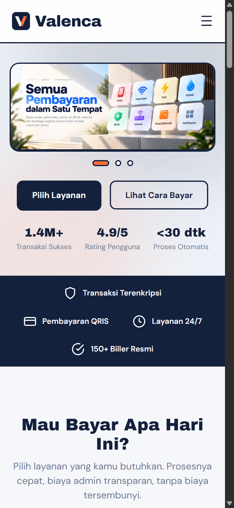

# Valenca — PPOB Payment Platform

Full-stack payment point (PPOB) platform for everyday transactions — pulsa, PLN token, paket data, PDAM, BPJS, internet, e-money, and multifinance — with a QRIS checkout flow, real-time order tracking, and a self-serve admin panel. Built with Next.js App Router, deployed on Vercel.

**Live:** [valenca-psi.vercel.app](https://valenca-psi.vercel.app)



## Highlights

**Customer-facing**

- **Product catalog** across 8 payment categories with per-product pricing tiers
- **Payment wizard** (`/bayar/[id]`) — guided checkout that prints a QRIS payment code
- **Order tracking** (`/cek-transaksi`) — enter an order number and follow the full status lifecycle (pending → paid → done/failed), with a downloadable PDF receipt
- **Help center** (`/bantuan`) — instant search, category filters, and FAQ accordions, backed by FAQPage structured data
- **About, terms, and privacy pages** driven by the same CMS settings
- **SEO-ready** — dynamic metadata, Open Graph tags, sitemap, and robots

**Admin panel**

- Password login with HMAC-signed session cookie (no framework, no extra deps)
- Product & pricing CRUD backed by Supabase
- Order management with a status flow (confirm payment, mark done, fail with reason)
- One-screen site settings — copy, contact info, SEO, QRIS image, hero banners — that propagate to every page on save
- WhatsApp link is **derived automatically** from the phone number: change the number once, every wa.me button on the site updates
- Cloudinary uploads with signed requests, 2 MB / JPG-PNG-WebP validation, and live preview

**Architecture**

- **DB-first data layer** with static fallback (`data/*.ts`) — the site runs even before the database is seeded
- Server components by default; client components receive data as props
- Admin mutations via React server actions; images via signed Cloudinary uploads

## Screenshots

| Order tracking | Help center |
| --- | --- |
|  |  |

| Admin settings | Mobile |
| --- | --- |
|  |  |

## Tech stack

| Layer | Choice |
| --- | --- |
| Framework | Next.js 16 (App Router, Turbopack) + React 19 |
| Language | TypeScript |
| Styling | Tailwind CSS v4, design tokens in `globals.css` |
| Motion | Framer Motion |
| Database | Supabase (Postgres) |
| Media | Cloudinary (signed uploads, f_auto/q_auto) |
| Receipts | jsPDF |
| Hosting | Vercel |

## Getting started

```bash
git clone https://github.com/ersetdigital-sudo/Valenca.git
cd Valenca
npm install
cp .env.example .env.local   # then fill in the values
npm run dev
```

Environment variables (see `.env.example`):

| Variable | Purpose |
| --- | --- |
| `NEXT_PUBLIC_SUPABASE_URL` | Supabase project URL |
| `SUPABASE_SERVICE_ROLE_KEY` | Server-side DB access |
| `CLOUDINARY_CLOUD_NAME` / `_API_KEY` / `_API_SECRET` / `_UPLOAD_PRESET` | Signed image uploads |
| `ADMIN_PASSWORD` | Admin login password |
| `ADMIN_SESSION_SECRET` | Secret for the HMAC session cookie |

Database schema and seed live in `supabase/migrations/`. Apply them to your Supabase project, or run the app with the static fallback data first.

```bash
npm run typecheck   # tsc --noEmit
npm run build       # production build
npm run start       # serve the build
```

## Project structure

```
app/                  # App Router pages (home, bayar/[id], cek-transaksi,
                      #   bantuan, tentang-kami, legal pages, admin/*)
components/           # UI — home, payment wizard, help center, admin panel
lib/                  # data layer (DB-first + fallback), supabase,
                      #   cloudinary, auth, wa link helper
data/                 # static fallback content
types/                # shared TypeScript contracts
supabase/migrations/  # schema + seed
scripts/              # seed generator
docs/screenshots/     # README images
```

## License

All rights reserved.
